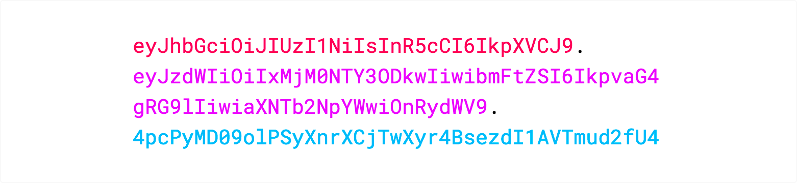

# JWT (JSON Web Tokens)

### What is structure of a JWT?

In its compact form, a JWT consist of three parts separated by dots (`.`), which are:

1. Header
2. Payload
3. Signature

Therefore, a JWT typically looks like the following:

```
xxxxx.yyyyy.zzzzz
```

### Header

The header _typically_ consists of two parts: the type of the token, which is JWT, and the signing algorithm being used, such as HMAC SHA256 or RSA.

For example:

```json
{
  "alg": "HS256",
  "typ": "JWT"
}
```

Then, this JSON is **Base64Url** encoded to form the first part of the JWT.

### Payload

The second part of the token is the payload, which contains the **claims**.

Claims are statements about an entity (typically, the user) and additional data.
There are three types of claims: _registered_, _public_, and _private_ claims.

- **[Registered claims:](https://tools.ietf.org/html/rfc7519#section-4.1)** These are a set of predefined claims which are not mandatory but recommended, to provide a set of useful, interoperable claims.
  Some of them are: **iss** (issuer), **exp** (expiration time), **sub** (subject), **aud** (audience), and others.

  > Notice that the claim names are only three characters long as JWT is meant to be compact.

- **[Public claims:](https://tools.ietf.org/html/rfc7519#section-4.2)** These can be defined at will by those using JWTs.
  But to avoid collisions they should be defined in the [IANA JSON Web Token Registry](https://www.iana.org/assignments/jwt/jwt.xhtml) or be defined as a URI that contains a collision resistant namespace.

- **[Private claims:](https://tools.ietf.org/html/rfc7519#section-4.3)** These are the custom claims created to share information between parties that agree on using them and are neither _registered_ or _public_ claims.

An example payload could be:

```json
{
  "sub": "1234567890",
  "name": "John Doe",
  "admin": true
}
```

The payload is then **Base64Url** encoded to form the second part of the JWT.

### Signature

To create the signature part you have to take the encoded header, the encoded payload, a secret, the algorithm specified in the header, and sign that.

For example if you want to use the HMAC SHA256 algorithm, the signature will be created in the following way:

```
HMACSHA256(
  base64UrlEncode(header) + "." +
  base64UrlEncode(payload),
  secret)
```

The signature is used to verify the message wasn't changed along the way, and, in the case of tokens signed with a private key, it can also verify that the sender of the JWT is who it says it is.

### Putting all together

The output is three Base64-URL strings separated by dots that can be easily passed in HTML and HTTP environments, while being more compact when compared to XML-based standards such as SAML.

The following shows a JWT that has the previous header and payload encoded, and it is signed with a secret.

